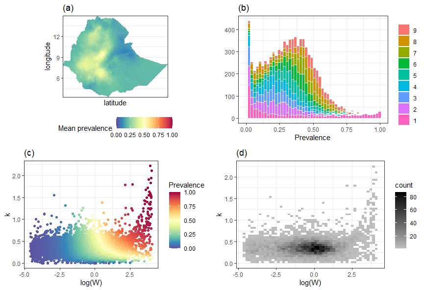

# AMISEpi
 
This package is associated with the following manuscript:

 Renata Retkute. Panayiota Touloupou. María-Gloria Basáñez. T. Déirdre Hollingsworth. Simon E. F. Spencer. "Integrating geostatistical maps and infectious disease transmission models using adaptive multiple importance sampling." Ann. Appl. Stat. 15 (4) 1980 - 1998, December 2021. https://doi.org/10.1214/21-AOAS1486 

#### Installation

```r
library(devtools)

install.packages("gridExtra")

install.packages("mclust")

install.packages("mnormt")

install.packages("plyr")

install_github("rretkute/AMISEpi@main")
``` 

#### Example use: Ascariasis in Ethiopia

```r
library(AMISEpi)

data(prev)

data(coord)

ans<-run_AMIS_ascaris(prev=prev, n.param=2, NN=rep(1000, 100), delta=5, ESS.R=2000)

plot_AMIS_Ascaris(coord, ans)
``` 

Results  for  Ascaris  lumbricoides  in  Ethiopia.  


